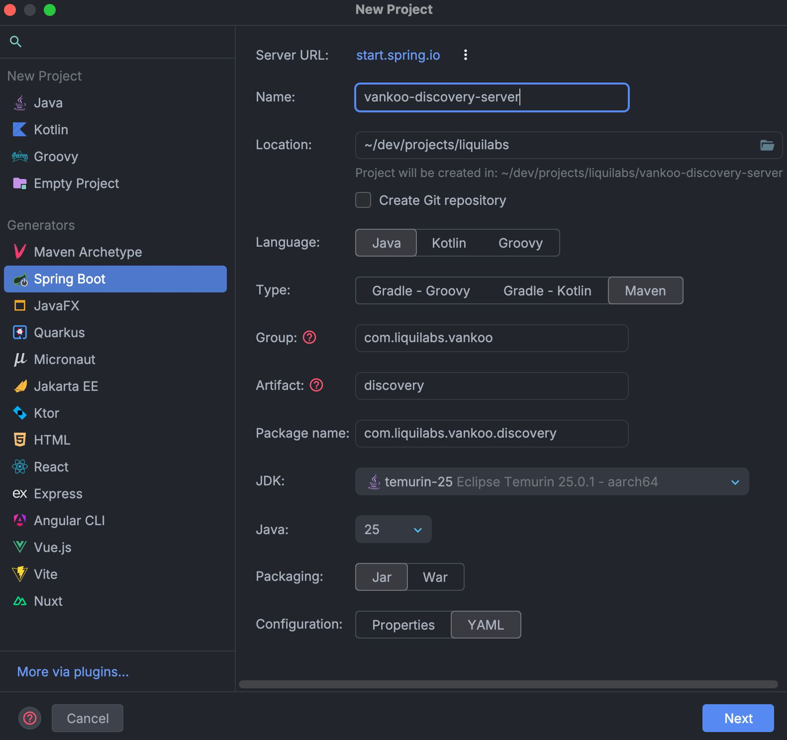
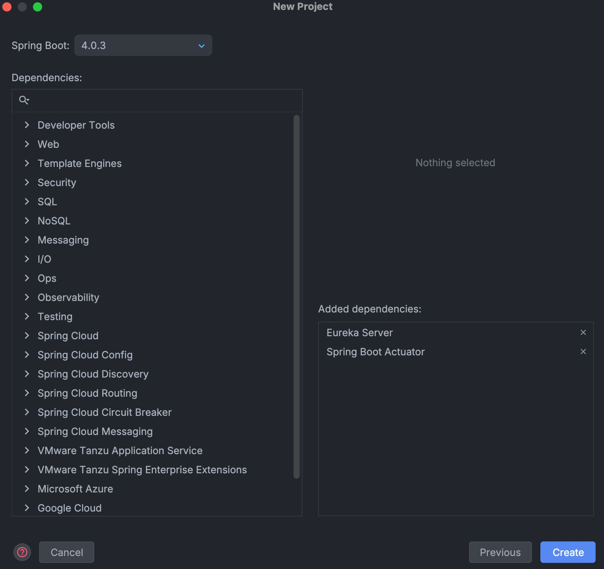

# Configuración del Proyecto

## Creación del Proyecto

Este proyecto se ha creado utilizando la interfaz de IntelliJ IDEA Ultimate, aprovechando su integración con Spring Initializr para configurar rápidamente un proyecto Spring Boot con las dependencias necesarias.

- **Name:** Se eligió `vankoo-discovery-service` para reflejar claramente su función dentro del ecosistema de microservicios de Vankoo, enfocándose en la gestión de descubrimiento de servicios y registro en Eureka.
- **Location:** Idealmente ubicado en el mismo nivel que otros proyectos relacionados, como `vankoo-infra`, para facilitar la gestión del `docker-compose` y la integración entre servicios.
- **Language:** Java, dado que es el lenguaje principal para el desarrollo de microservicios con Spring Boot.
- **Type:** Maven, por su amplia adopción y compatibilidad con Spring Boot, además de facilitar la gestión de dependencias y la construcción del proyecto.
- **Group:** `com.liquilabs.vankoo`, siguiendo la convención de nomenclatura de paquetes en Java (dominio invertido), reflejando la startup (Liquilabs) y el proyecto (Vankoo).
- **Artifact:** `discovery`, nombre que refleja claramente la función del servicio dentro del ecosistema de Vankoo, centrado en la gestión de descubrimiento de servicios. Omitimos el sufijo `server` para mantenerlo conciso.
- **Package name:** `com.liquilabs.vankoo.discovery`, siguiendo la convención de nomenclatura de paquetes en Java, reflejando la estructura del proyecto y su función específica dentro del ecosistema de Vankoo.
- **JDK:** temurin-25, la última versión del JDK, que ofrece mejoras de rendimiento y nuevas características, asegurando que el proyecto esté actualizado y sea compatible con las últimas tecnologías.
- **Java:** 25, para aprovechar las últimas características del lenguaje y garantizar la compatibilidad con el JDK seleccionado.
- **Packaging:** Jar, ya que es el formato estándar para aplicaciones Spring Boot, facilitando su ejecución y despliegue.
- **Configuration:** YAML, por su legibilidad y facilidad de uso para la configuración de Spring Boot, permitiendo una estructura clara y organizada para las propiedades del proyecto.

## Dependencias

Se usó la última versión de Spring Boot (4.0.2) y se seleccionaron las siguientes dependencias para cubrir las necesidades del servicio:

- **Eureka Server:** Para configurar este proyecto como un servidor de Eureka, permitiendo que otros microservicios se registren y descubran entre sí.
- **Spring Boot Actuator:** Para exponer endpoints de monitoreo y salud del servicio.

No hacen falta otras dependencias como Spring Web, Data JPA, etc., ya que este servicio se enfoca exclusivamente en el registro y descubrimiento de servicios a través de Eureka, sin necesidad de manejar lógica de negocio adicional o acceso a bases de datos.

